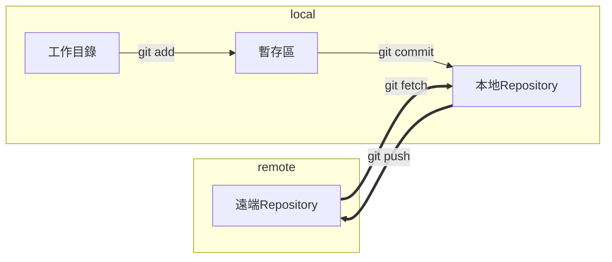
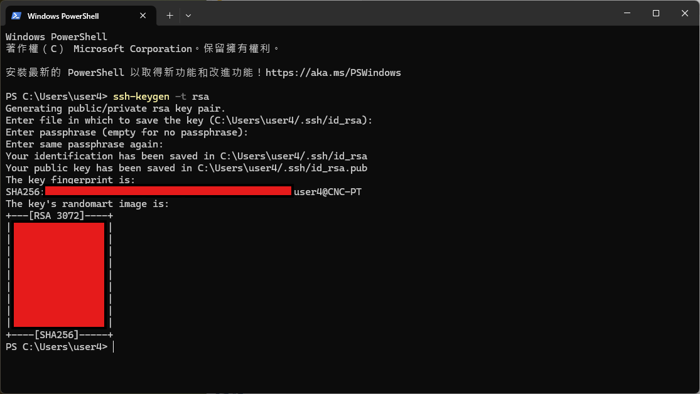
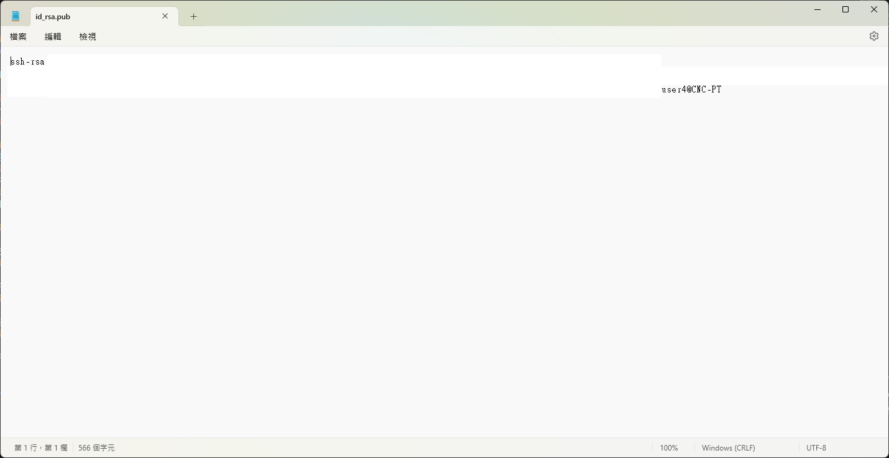
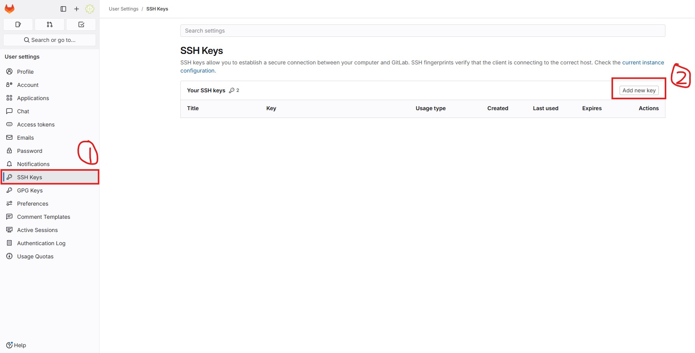

# Git
[[toc]]
如下圖所示依序點擊`Code > `

Git是一款版本控管工具其架構大致可分為遠端與本地端如下圖所示

在使用Git時我們可以自由編輯的區域叫做工作目錄也就是我們當前專案所處的資料夾，
當文件編輯完後需要做一次版本紀錄的話就將該版本所需要納入的文件用`git add`加入暫存區內，
接著用`git commit`將當前已加入暫存區的檔案提交為一個版本，
並將此版本納入本地版本庫(Local Repository)中，
如果遠端版本庫(Remote Repository)可以連線的話，
就可以用`git push`將本地端所有尚未推送之版本紀錄推送到遠端的版本管理庫中，

```mermaid
sequenceDiagram
    participant wd as 工作目錄
    participant temp as 暫存區
    participant repoLocal as Local Repository
    participant repoRemote as Remote Repository
    rect rgb(0, 0, 0)
    wd->>temp:git add
    temp->>repoLocal:git commit
    repoLocal->>repoRemote:git push
    repoRemote ->> repoLocal:git fetch
    repoLocal->>wd:git checkout
    repoLocal->>wd:git merge
    repoRemote ->> wd:git pull
    end

```

# 常用指令

### git clone with HTTPS
將伺服器的版本庫複製回本地的作業環境中，以計中維護教學頁面為例。

如下圖所示依序點擊`Code > `

並且在你想要存放的位置叫出cmd，輸入`git clone`後貼上剛剛複製的連結，按下enter後即可複製遠端的版本庫至本地端。

### git clone with SSH
如果想要利用GitLab的SSH進行`git clone`的話，可以先到本地端的Windows PowerShell輸入`ssh-keygen -t rsa`

如果沒有要設定存檔路徑或是通行密碼可以直接按`enter`到底，結果如下

可以到剛剛存檔的路徑找到id_rsa.pub的檔案並開啟然後將ssh-rsa......等全部字串複製下來

打開GitLab後選擇設定並依序點擊SSH Keys > Add new key

將剛剛複製的字串全部貼上後再輸入標題和失效期限就可以了。

到要複製下來的專案頁面選擇`Clone with SSH`，之後的操作就和clone with HTTPS一樣。

### git status
    
    查看當前目錄下的git資訊
### git add 
    
    將檔案加入版本控管追蹤
### git commit 
    
    提交一個新的版本
### git push 
    
    將本地端的版本更新到遠端伺服器
### git pull
    
    將遠端伺服器的版本更新到本地作業環境
### git fetch 
    
    獲取伺服器端的版本資訊但不進行更新
