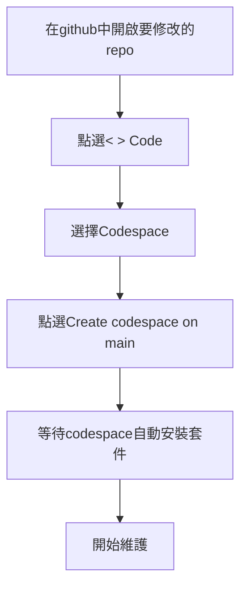
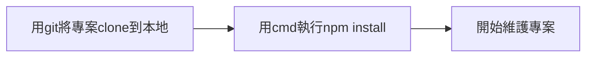

# Node JS

[[toc]]

Node JS 是一款運行JavaScript的開放原始碼跨平台執行環境，
它提供了一個溝通橋梁讓原本只能運行在網頁上的JaveScript得以直接與作業系統層的API溝通，
並且使用npm作為套件管理工具，以下是幾個常用的npm指令

:::warning  注意事項
在執行指令前需要先確認命令提示字元(CMD、PowerShell等...bash工具)所在目錄(CWD Current Working Directory)為專案的目錄位置。
:::

|     指令      |      功能       |
| :-----------: | :-------------: |
|  npm run OOO  |   執行script    |
|  npm install  |    安裝套件 (在所有Node專案剛clone時第一個執行的指令)   |
| npm uninstall |  解除安裝套件   |
|    npx OOO    | 直接執行OOO套件 |

:::info
在維護專案時請先確認是否有裝好套件，並且package.json內的指令需要在安裝完套件後才能使用。在維護時可以使用github的codeSpace，或是使用git clone將專案抓到到本地端進行維護
- 1 使用codeSpace維護專案步驟如下



- 2 使用git clone維護專案的步驟如下：


:::

## npm run 
npm run 是用來執行
`package.json`中`scripts`欄位中所寫的指令，
以此專案為例這裡可以看到scripts中有三個指令分別為`start`, `build`, `deploy`。
如果需要執行deploy的話只需要輸入`npm run deploy`即可。

```json
{
  "name": "nptucnc",
  "version": "1.0.0",
  "main": "index.js",
  "license": "MIT",
  "keywords": [],
  "author": "MX,Du",
  "description": "",
  "scripts": {
    "start": "vuepress dev docs",
    "build": "vuepress build docs",
    "deploy": "npm run build && gh-pages -d build"
  },
  "devDependencies": {
    "vuepress": "^2.0.0-beta.53"
  },
  "dependencies": {
    "ansi-regex": "^6.0.1",
    "anymatch": "^3.1.2",
        .
        .
        .
  }
}

```

## npm install
npm install是npm在安裝套件時所使用的指令，
如果需要安裝package.json中註記的所有套件的話只需要輸入`npm install`就會自動安裝所有的套件，
如果要安裝特定的套件的話就在install後方輸入套件名稱，
假設要安裝express的話就輸入`npm install express`即可。


## package.json
package.json是npm中用以記錄、管理套件的一個文檔，
其中`devDependencies`、`dependencies`、`scripts`這三個區塊是最重要的，
### devDependencies
這個區塊記載僅限於開發時會使用的套件(在正式環境中並不會使用這些套件)，
如果要安裝這類的套件可使用
`npm install --save-dev packageName`來安裝。
### dependencies
dependencies內紀錄在正式環境中會使用到的套件，
如果要安裝此類套件的話可以用`npm install --save packageName`來進行安裝，
或是直接輸入`npm install packageName`。
### scripts
scripts這個欄位裡記錄可以被`npm run`執行的指令，
假設需要一個指令為test的並且自動測試位於src裡的index.js的話就可以這樣編輯
```json
{
    "scripts":{
        "test":"node src/index.js"
    }
}
```
編輯好後如果之後需要測試的話就可以輸入`npm run test`這樣npm就會自動執行test中所撰寫的指令。


